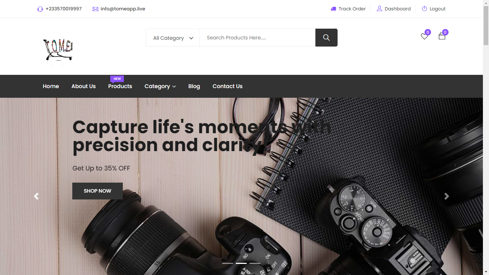

# TomeAPP

#### *A Laravel e-commerce website*



Welcome to [tomeApp](https://tomeapp.live/), a modern e-commerce platform powered by Laravel, Tailwind CSS, and Alpine.js. Specializing in Electronic Appliances, Accessories and Clothing, we focus on delivering a seamless shopping experience with intuitive design, user-friendly navigation, and secure checkout processes.

This project was developed as part of our final project at [ALX](https://www.alxafrica.com/).

## Tech Stack

### Backend
- Laravel Framework
  - Controllers
  - Models
  - Eloquent Relationships
  - Middleware

### Frontend
- Tailwind CSS
- Alpine.js
- Blade Templating Engine

### Database
- MySQL
  - Migrations
  - Seeders

### Security
- Authentication and Authorization
- CSRF Protection
- Validation

### Deployment and Operations
- Digital Ocean Ubuntu 20.04 droplet
- Apache2
- Namecheap domain name

### Testing
- PHPUnit

### Development and Version Control
- Git and GitHub
- Docker (via Laravel Sail)

This architecture is designed to be modular and scalable, allowing for updates and replacements without major overhauls to the entire application.

## Features
- **User Authentication**: Secure login and registration system powered by Laravel Breeze.
- **Product Catalog**: Dynamic product listings with categories, sizes, and images.
- **Cart Management**: Session-based cart system for adding and removing products.
- **Order Processing**: Simplified checkout process and order history tracking for registered users.
- **Responsive Design**: Fully responsive web design with Tailwind CSS for an optimal shopping experience.
- **Dynamic Interactions**: Minimal, intuitive interactions with Alpine.js for a smooth frontend experience.

## Getting Started
### Prerequisites
- PHP >= 7.4
- Composer
- Docker
- npm or Yarn
- MySQL

### Installation
1. Clone the repository

```
git clone https://github.com/IdiJr/tomeAPP.git
cd tomeAPP
```
2. Set up your environment file
Copy the `.env.example` file to a new file named `.env`, and configure your application and database settings.
```
cp .env.example .env
```
3. Install JavaScript dependencies and compile assets
```
npm install
# or, if you use yarn
yarn install
```
4. Install PHP dependencies
```
composer install
```
5. Link the storage
```
php artisan storage:link
```
6. Generate an application key
```
php artisan key:generate
```
7. Run database migrations and seeders
```
php artisan db:seed
```
8. Serve the application
```
php artisan serve
```
Your application should now be running on [http://localhost:8000](http://localhost:8000).

### Contributing
We welcome contributions to tomeAPP. Please read our contributing guidelines before submitting pull requests to the project.

## Acknowledgments
We want to express our gratitude to the following resources and individuals who greatly contributed to the development of the tomeAPP project:

### Resources:
1. [Laravel Documentation](https://laravel.com/docs/10.x/installation)
2. [Digital Ocean Nginx with Laravel Installation](https://www.digitalocean.com/community/tutorials/how-to-install-and-configure-laravel-with-nginx-on-ubuntu-22-04)
3. [Tailwind CSS Documentation](https://tailwindcss.com/)
4. [Digital Ocean Server Setup](https://www.digitalocean.com/community/tutorials/initial-server-setup-with-ubuntu-20-04)
5. [ChatGPT](https://chat.openai.com)

Your application should now be running on [http://localhost:8000](http://localhost:8000).

### Contributing
We welcome contributions to tomeAPP. Please read our contributing guidelines before submitting pull requests to the project.

## Acknowledgments
We want to express our gratitude to the following resources and individuals who greatly contributed to the development of the tomeAPP project:

### Resources:
1. [Laravel Documentation](https://laravel.com/docs/10.x/installation)
2. [Digital Ocean Nginx with Laravel Installation](https://www.digitalocean.com/community/tutorials/how-to-install-and-configure-laravel-with-nginx-on-ubuntu-22-04)
3. [Tailwind CSS Documentation](https://tailwindcss.com/)
4. [Digital Ocean Server Setup](https://www.digitalocean.com/community/tutorials/initial-server-setup-with-ubuntu-20-04)
5. [ChatGPT](https://chat.openai.com)

### Individuals:
- We acknowledge the [ALX](https://www.alxafrica.com/) community and the wider community of developers and contributors whose open-source projects, discussions, and code snippets served as a source of inspiration and learning.

We wouldn't have been able to complete this project without the support of these resources and individuals. Your contributions have been invaluable, and we are grateful for the knowledge, encouragement, and camaraderie that fueled the development of [tomeAPP](https://tomeapp.live/). Thank you!
